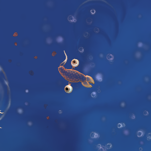
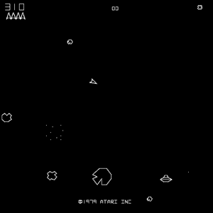

# Eat n' Shoot

## I. High Concept

Eat N' Shoot is a physics based browser game that acts like a combination
of the cell stage from Spore and a classic Shoot 'Em Up like Asteroids.

----

## II. Genre

Twin-Stick Shooter.

----

## III. Platform

Desktop Browser.

----

## IV. Story

A time-traveller has sent a genetically modified Dinosaur to the past that 
is capable of immediately growing based on how much it eats. It also shoots lasers! The time-traveller also programmed his creation to hate other dinosaurs, and want to eat them.

----

## V. Aesthetics

Dinosaurs and Nature, cartoonish art.

----

## VI. Gameplay

The player navigates around an environment, looking to eat things and grow bigger! The bigger you get, the better the food, and the bigger the threats. At the same time, keep yourself safe with your laser weapon!

----

## VII. Screenshots

----

## VIII. Other

Reference images are from StrategyWiki and Wikipedia, respectively. 

----

## IX. About Me

I'm a second year Game Design and Development major, developing this for my Intro to Game Web Tech class.

----